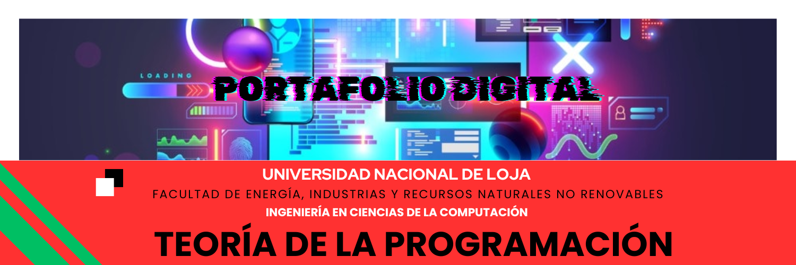

 

# 📑 PORTAFOLIO DIGITAL DE APRENDIZAJE
## <kbd>Ingeniería en Computación<kbd> | *Ciclo 2024 - 2025*

---

### 🏦 DATOS INFORMATIVOS
*Identificación del Estudiante y Docente*

| 📋 CAMPO | ✍️ DESCRIPCIÓN |
| :--- | :--- |
| **DOCENTE:** | Ing. Lissette Geoconda López Faicán |
| **ESTUDIANTE:** | Yuleisy Cecibel Jaramillo Jaramillo |
| **CICLO / PARALELO:** | Primer Ciclo Paralelo A |
| **MATERA:** | Teoría de la Programación |

---

## 🚀 INTRODUCIÓN
> Este portafolio tiene resumes de todo lo visto en la materia de Teoría de la Programación:
> * 🗒️ Resumenes
> * 💡Ejemplos
> * 🛠️ Aplicación de lo aprendido
> * 💻 Ejercicios Prácticos
> * 🎯Concluciones que enfatizan la importancia la importancia de los conocimientos adquiridos.

## 🗂️ MAPA DE NAVEGAGACIÓN (ÍNDICE)
**Haz clic para entrar a las carpetas y contenido del protafolio**
