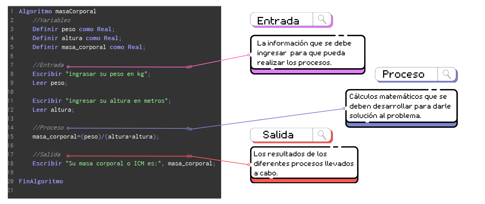
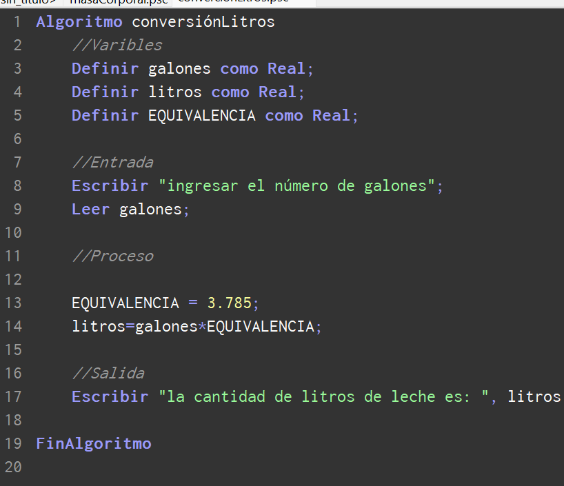
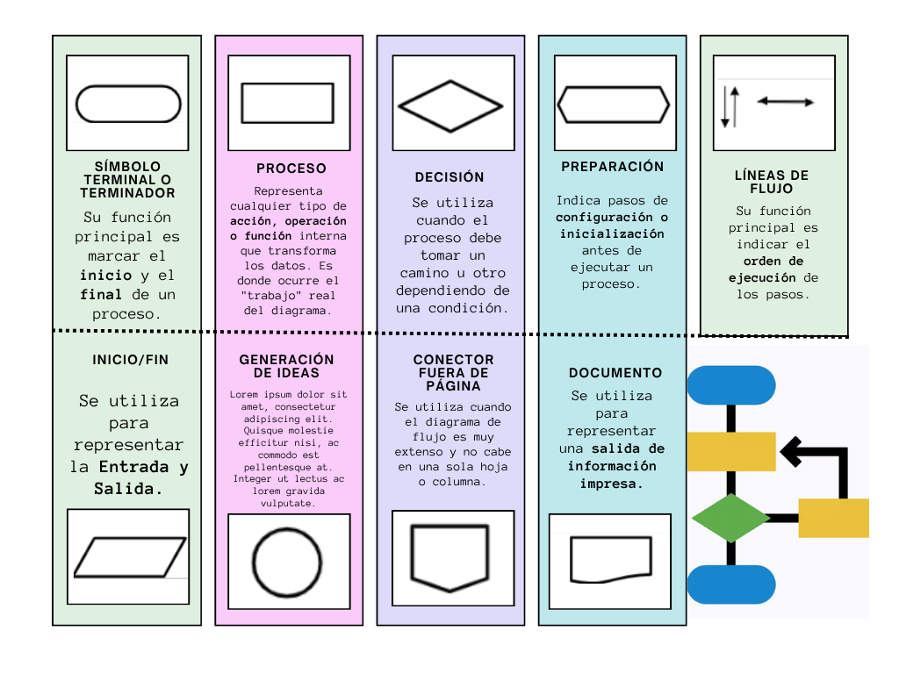
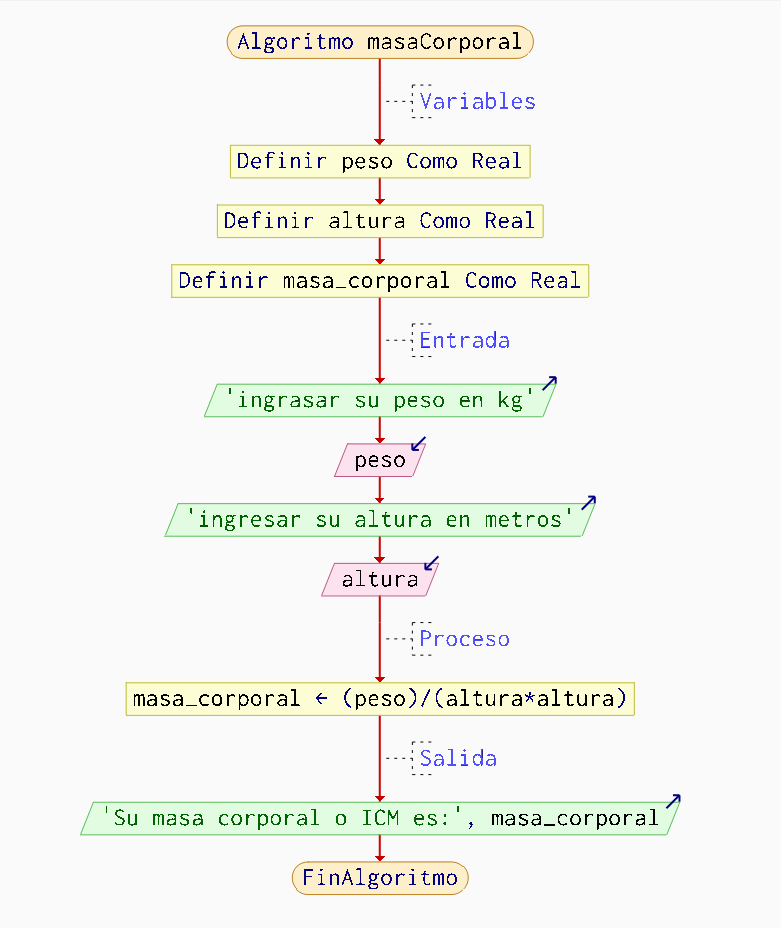
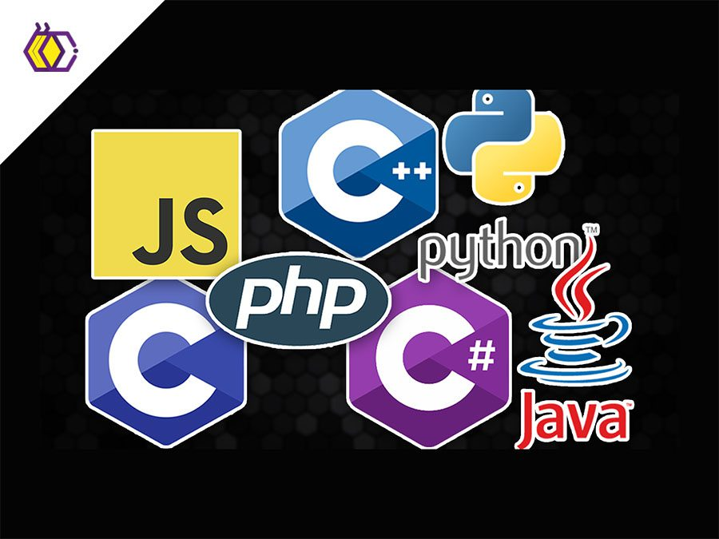
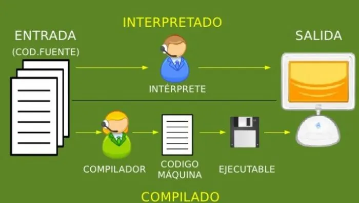
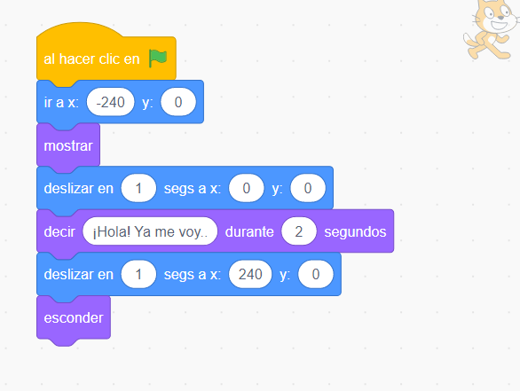
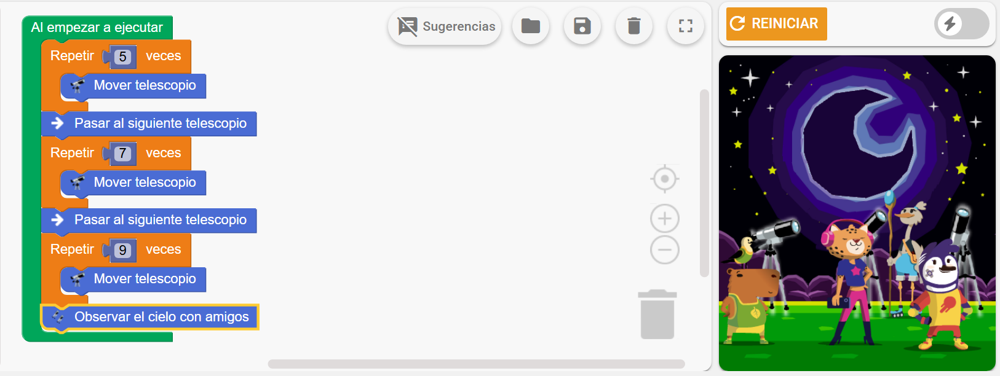
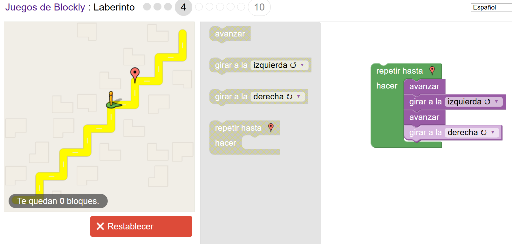

  

 

# 1. Algoritmo
## 1.1. Definición
A los algoritmos se los puede definir como una serie de pasos o intrucciónes que mediante un **orden secuencial** que permiten resolver problemas o realizar tareas específicas. 
## 1.2. Pasos para resolver problemas
* **Análisis del problema:** Identificar datos de entrada, proceso y salida.
* **Diseño (algoritmo):** Determina cómo realiza el programa (Pseudocódigo y Diagramas de Flujo).
* **Codificación:** Traduce el diseño a un lenguaje de programación.
* **Pruebas:** Elimonación de errores. 
* **Documentación y mantenimiento:** Evidenciar todo lo trabajado en un documento.
## 1.3. Clasificación 
| Tipo de algoritmo | Describción | Ejemplos |
| :--- |:--- |:--- |
| **Cualitativas:** | Implique la descripción a través de frases y palabras | * Receta de Cocina   * Cambiar una llanta |
| **Cuatitativas:** | Se refiere al uso de cálculos o fórmulas matemáticas | *  Calcular el área de un cuadrado   * Calcular el promedio de 3 notas |
## 1.4. Características
* **🎯Preciso:** Indicar el orden de cada paso de manera clara y sin ambigüedades.
* **🔒Definido:** El algoritmo es predecible y exacto.
* **🔚Finito:** Tiene inicio y fin   
## 1.5. Partes y ejemplo de algoritmo

  

 

## 1.6. Formas de representar un algoritmo 
### 1.6.1. Pseudocódigo
> Es una forma de representar algoritmos utilizando una mezcla de lenguaje natural (español/inglés) y estructuras de programación, actuando como un borrador lógico. No es ejecutable por la computadora, pero permite planificar la lógica sin restricciones sintácticas.
#### 1.6.1.1. *Características:*
* **Legibilidad:** Está diseñado para ser entendido fácilmente.
* **Estructura:** Utiliza estructuras similares a lenguajes reales.
* **Secuencial:** Las instrucciones sique un orden lógico.
#### 1.6.1.2. *Objetivo:*
* Ayuda a los programadores a centrarse en la lógica del problema en lugar de la sintaxis.
* Funciona como un boceto antes de escribir el código fuente final.
* Permite explicar algoritmos a personas no técnicas o a otros desarrolladores.
*  Ayuda a encontrar fallos lógicos temprano.
#### 1.6.1.3. *Ejemplo:*

  

 

### 1.6.2. Diagrama de flujo 
> Utiliza símbolos y describen las instrucciones que debe seguir el algoritmo.
#### 1.6.2.1. *Caracteristicas:*
* **Visualización clara:** Sustituye descripciones textuales largas por imágenes, facilitando la comprensión.
* **Beneficios:** Ayuda a identificar problemas, duplicidades, cuellos de botella y oportunidades de mejora en un procedimiento.
#### 1.6.2.1. *Símbolos:*

  

 

#### 1.6.2.2. *Ejemplo:*

  

 

## 1.7. Elementos de algoritmos
### 1.7.1. Datos
Son información sobre algo, puede ser: una letra, símbolo, número, palabra, etc. Y dependiendo del tipo los datos se almacenan en la compuadora. 
#### 1.7.1.2. Tipos
##### Simples
* **Enteros (int):** 1,2,3,4,5,6,7,8,9...
* **Reales (float/double):** 1,44443; 2/3...
* **Carácter (char):** a, B, -...
* **Lógicos (boolean):** TRUE/FALSE
##### Compuestos
* **Cadena**: Conjunto de carácteres.
### 1.7.2. Identificador
Su propócito es identificar un objeto del programa, pueden ser varibles o constantes.
> ***Variables:*** Este tipo de identificador guarda un valor, el cual, se puede modificar durante el programa. 
> ***Constantes:*** Este tipo de indentificador también guarda un valor, pero a diferencia de una variable esta no cambia durante la ejecución del algoritmo. 

---

# 2. Prueba de escritorio
## Definición
Proceso manual para verificar que la lógica de un algoritmo o diagrama de flujo funciona correctamente, sirve para:
* Detectar errores
* Verificar resultados
* Comprender el flujo
## Ejemplo
| Paso | peso | altura | masa_corporal | Pantalla (Salida) |
| :--- | :--- | :--- | :--- | :--- |
| 1.Inicio | | | | (Inicio del algoritmo) |
| 2.Definir variables | 0.0 |0.0 | 0.0 | | 
| 3. Entrada | - | - | - | "ingresar su peso en kg" |
| 4. Leer peso | 70 | - | - | - |
| 5. Entrada| - | - | - | "ingresar su altura en metros" | 
| 6. Leer altura| 70 | 1.75 | - | - |
| 7. Proceso (Cálculo) | 70 | 1.75 | 22.85 | (Se calcula: \(70 / (1.75 \times 1.75)\)) 
| 8. Salida | 70 | 1.75 | 22.85 | "Su masa corporal o ICM es: 22.85" |
| 9. Fin | - | - | - | (Fin del algoritmo) |

---

# 3. Lenguajes de programación 

  

 

Un lenguaje de programación es un conjunto de reglas, símbolos y palabras especiales que permiten al ser humano darle instrucciones a una computadora. 
La computadora solo entiende lo que es el **lenguje binario** (una convinación de 1 y 0 ) y las personas tenemos nuestros propios idiomas, por lo que, es complicado darle instruciones a una computadora (programa), es ahí donde estan los lenguajes de programación, estas herramientas son como el **traductor** que permite a la computadora entendernos, es decir, convierte instruciones hechas con lenguaje humano en 0 y 1. 
## 3.1. Clasificación 
### 3.1.1 Lenguaje máquina:
El lenguaje de máquina es el nivel más básico y "nativo" que entiende una computadora. Es el único idioma que los circuitos del procesador pueden ejecutar directamente.
* Se compone exclusivamente de una secuencia de ceros (0) y unos (1).
* Estos representan estados eléctricos (encendido/apagado).
#### Ejemplo:
  **5+3=**   
  10111000 00000101 00000000 (Carga el 5)   
  10111011 00000011 00000000 (Carga el 3)   
  00000001 11011000 (Súmalos)    
### 3.1.2. Lenguaje bajo nivel:
Un lenguaje de bajo nivel es hablarle a la computadora "en su propio idioma".En lugar de darle órdenes generales (como "reproducir un video"), hay que darle instrucciones paso a paso sobre cómo debe mover la electricidad y los datos dentro de sus piezas (el procesador y la memoria).
* **Lenguaje Ensamblador:** (Tipo de LENGUAJE DE BAJO NIVEL) Es el que usa los mnemotécnicos (abreviaturas) que mencionaste antes. Es una traducción directa del binario a palabras cortas para que un humano pueda leerlo.
* **Ejemplo:** MOV AL, 61h (Mueve el valor 61 al registro AL).
### 3.1.3. Lenguaje alto nivel
Es un lenguaje de programación diseñado para que los humanos podamos escribir instrucciones de forma lógica y natural, utilizando palabras del idioma inglés (como if, while, print, return) en lugar de códigos técnicos complicados.  
**Ejemplo:**  
* Phyton
* Java
### 3.1.4. Lenguaje algorítmico
Es una forma de redactar la solución a un problema utilizando acciones primitivas (instrucciones básicas como leer, escribir o calcular) tomadas de nuestro lenguaje natural. Esto permite que el algoritmo se escriba en español, facilitando que cualquier persona entienda la lógica del proceso antes de traducirlo a un lenguaje de programación real.  
**Ejemplo:**  
La instrucción de restar sería 19-11=8

---

### 3.1.5. Lenguaje compilado
Un lenguaje compilado es aquel cuyo código debe ser traducido por completo de una sola vez por un programa llamado compilador, antes de que la computadora pueda entenderlo o ejecutarlo.
* Escribes tu código, el compilador lo lee todo, lo revisa y genera un archivo nuevo (el ejecutable o .exe).
* Una vez creado ese archivo, la computadora lo corre directamente sin necesidad de volver a leer el código original.
### 3.1.6. Lenguaje interpretado
Es aquel en el que el código no se traduce por completo de antemano, sino que un programa llamado intérprete lo lee y lo ejecuta línea por línea en tiempo real.

  

*
  
 

**Relación entre Lenguaje Interpretado y Lenguaje copilado**

---

  
# 4. PROGRAMACIÓN POR BLOQUES

 

## 4.1. ¿Qué es la programación de bloques?
La programción de bloques es una forma de programación en el que no se tiene que escribir códigos ni opalabras especializadas de manera manual, sino, que usa piezas visuales, las cuales se tiene que conectar a manera de rompecabezas para crear un algoritmo.
## 4.2. Ventajas 
* **Aprender a programar:** Es la puerta de entrada ideal para niños y principiantes porque elimina la frustración de cometer errores de escritura.
* **Desarrollo rápido:** Permite crear juegos, animaciones o aplicaciones sencillas de forma muy veloz.
* **Visualizar algoritmos:** Ayuda a entender conceptos complejos de programación de manera visual y entretenida
## 4.2. Características 
* Interfaz Visual (No se escribe texto).
* Funciona al conectar las piezas evitando así errores en la redacción.
* Al eliminar la necesidad de recordar reglas gramaticales, el usuario se concentra totalmente en cómo resolver el problema.
## 4.3. Ejemplos:
* **Scratch:**  
  Es un lenguaje de programación visual y una comunidad en línea gratuita diseñada para que cualquier persona, especialmente niños y adolescentes de entre 8 y 16 años, pueda aprender a programar de forma lúdica y creativa.

 

* **PilasBloques**  
Es una herramienta educativa gratuita, desarrollada en Argentina por la Fundación Sadosky, diseñada para enseñar a programar a través de desafíos o "puzles" lógicos. Es ideal para dar los primeros pasos en el pensamiento computacional antes de pasar a herramientas más complejas como Scratch o Python.

 

* **Blokly.games**  
Es una serie de juegos educativos desarrollados por Google para enseñar los fundamentos de la programación a personas que no tienen experiencia previa. Es una plataforma gratuita y de código abierto que sirve como preparación para dar el salto a lenguajes de programación basados en bloques.

 

Has clik para continuar con la presentación del trabajo [Ejercicio](Ejercicios.md)  

