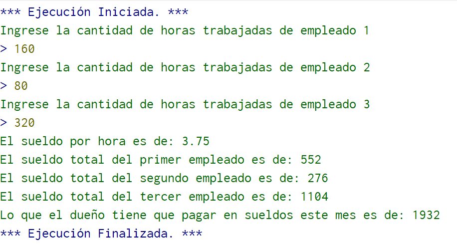
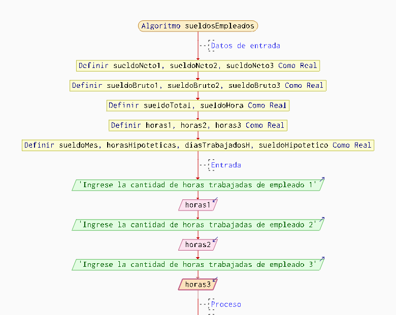
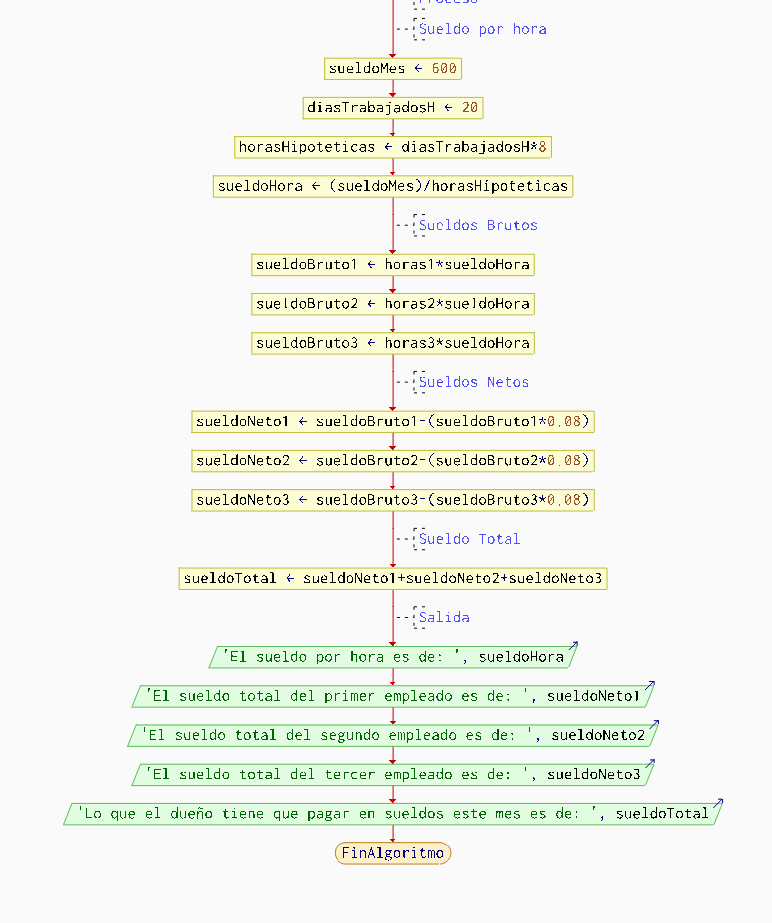

  

 

# Planteamiento de problema
Un propietario de un local comercial necesita calcular **el salario que debe pagar a cada uno de sus tres enpleados al final del mes**. El pago de cada trabajador depende de las horas trabajadas durante ese periodo.
Se sabe que un empleado que trabaja una jornada completa de 8 horas diarias durante 5 días a la semana recibe un salario de 600 dólares al mes.
Además, se aplicará un descuento del 8% sobre el salario bruto de cada empleado, el cual representa una deducción obligatoria. **Después de este descuento, se obtiene el salario neto final que recibirá cada trabajador**.
Adicional a esto el propietario tambien queiere saber **cuanto dinero gastara en los salarios de este mes.**
# Análisis del problema
Para resolver el problema lo primero que se tiene que hacer es identificar y dividir el ejercicio en las partes que conforma un algoritmo, es decir, establecer lo que se va a hacer en la **entrada**, **proceso**, y **salida**:
## Entrada
En esta sección se pide al usuario que ingrese las horas trabajadoa por cada empleado (empleado_1, empleado_2 y empleado_3), cabe recalcar que las variables necesarias para el algoritmo ya deben de eatr definidas con anterioridad.
## Proceso
Lo primero es saber cuanto se tiene que pagar a los empleados por hora para esto estaremos haciendo lo siguieente, sabemos que se le paga 600 dolares al mes a un empleado que trabaja 8 horas diarias durante 5 días de la semana. Lo que nos da que el empleado hipotético trabjo durante 20 días al mes si multiplicamos por la cantidad de horas diarias (8h) nos da 160h, luego dividimos los 600 dólares por 160 dandonos **3,35 dólares por cada hora**.
Como ya se ingreso la cantidad de horas que trabajó cada empleado multiplicamos el valor hantes obtenido por las horas respectivas. 
En lo que se trata el descuento del 8% del sueldo de cada uno de los empleados, se mutiplicará el salario bruto obtenido el el proceso anterior por 0,08 dandonos así el salario neto de cada uno de los empleados.
Por último, para obtener lo que el dueño tiene que gastar en el mes en salarios sumamos el el salario neto de cada empleado.
## Salida
Después de haber realizado el proceso tendremos los siguientes datos de salina:
* La cuanto se paga por hora
* Salario neto de cada empleado: empleado 1, empleado 2, y empleado 3.
* Lo que tiene que desembolsar el dueño por el pago de salarios en este mes.
Observando los datos de salida se comprueba que el problema esta resuelto. 
# Diseño del algoritmo 
*Para el diseño de algoritmo se utiliza PSeInt*  
## Pseudocódigo
**Si quiero ingresar al documento donde esta el algoritmo haga click aquí:**
  

Algoritmo sueldosEmpleados

	//Datos de entrada 
	Definir sueldoNeto1, sueldoNeto2, sueldoNeto3 Como Real;
	Definir sueldoBruto1, sueldoBruto2, sueldoBruto3 Como Real;
	Definir sueldoTotal, sueldoHora Como Real;
	Definir horas1, horas2, horas3 Como Real;
	Definir sueldoMes, horasHipoteticas, diasTrabajadosH, sueldoHipotetico  como Real;
	
	//Entrada
	Escribir "Ingrese la cantidad de horas trabajadas de empleado 1";
	Leer horas1;
	Escribir "Ingrese la cantidad de horas trabajadas de empleado 2";
	Leer horas2;
	Escribir "Ingrese la cantidad de horas trabajadas de empleado 3";
	Leer horas3;
	
	//Proceso
	//Sueldo por hora 
	sueldoMes=600;
	diasTrabajadosH=20;
	horasHipoteticas=diasTrabajadosH*8;
	sueldoHora=(sueldoMes)/horasHipoteticas;
	
	//Sueldos Brutos
	sueldoBruto1=horas1*sueldoHora;
	sueldoBruto2=horas2*sueldoHora;
	sueldoBruto3=horas3*sueldoHora;
	
	//Sueldos Netos
	sueldoNeto1=sueldoBruto1-(sueldoBruto1*0.08);
	sueldoNeto2=sueldoBruto2-(sueldoBruto2*0.08);
	sueldoNeto3=sueldoBruto3-(sueldoBruto3*0.08);
	
	//Sueldo Total
	sueldoTotal=sueldoNeto1+sueldoNeto2+sueldoNeto3;
	
	//Salida
	Escribir "El sueldo por hora es de: ", sueldoHora;
	Escribir "El sueldo total del primer empleado es de: ", sueldoNeto1;
	Escribir "El sueldo total del segundo empleado es de: ", sueldoNeto2;
	Escribir "El sueldo total del tercer empleado es de: ", sueldoNeto3;
	Escribir "Lo que el dueño tiene que pagar en sueldos este mes es de: ", sueldoTotal;
		
FinAlgoritmo  
**Terminal:**

  

 

## Digrama de flujo

  

  

 

# Codificación
Para la codificación se lo hace por el lenguaje C
  
#include <stdio.h>
int main(){

    //Variables
    float sueldoNeto1, sueldoNeto2, sueldoNeto3;
	float sueldoBruto1, sueldoBruto2, sueldoBruto3;
	float sueldoTotal, sueldoHora;
	float horas1, horas2, horas3;
	float sueldoMes, horasHipoteticas;
    float diasTrabajadosH, sueldoHipotetico;

    //Entrada
    printf("Ingrese la cantidad de horas trabajadas de empleado 1\n");
	scanf("%f", &horas1);
	printf("Ingrese la cantidad de horas trabajadas de empleado 2\n");
	scanf("%f", &horas2);
	printf("Ingrese la cantidad de horas trabajadas de empleado 3\n");
	scanf("%f", &horas3);

    //Proceso
    //Sueldo por hora 
	sueldoMes=600;
	diasTrabajadosH=20;
	horasHipoteticas=diasTrabajadosH*8;
	sueldoHora=(sueldoMes)/horasHipoteticas;
	
	//Sueldos Brutos
	sueldoBruto1=horas1*sueldoHora;
	sueldoBruto2=horas2*sueldoHora;
	sueldoBruto3=horas3*sueldoHora;
	
	//Sueldos Netos
	sueldoNeto1=sueldoBruto1-(sueldoBruto1*0.08);
	sueldoNeto2=sueldoBruto2-(sueldoBruto2*0.08);
	sueldoNeto3=sueldoBruto3-(sueldoBruto3*0.08);

    //Sueldo Total
	sueldoTotal=sueldoNeto1+sueldoNeto2+sueldoNeto3;

    //Salida
    printf("El sueldo por hora es de: %f\n", sueldoHora);
	printf("El sueldo total del primer empleado es de: %f\n", sueldoNeto1);
	printf("El sueldo total del segundo empleado es de: %f\n", sueldoNeto2);
	printf("El sueldo total del tercer empleado es de: %f\n", sueldoNeto3);
	printf("Lo que el dueño tiene que pagar en sueldos este mes es de: %f\n", sueldoTotal);

    return 0;
}
# Validación
| Paso | sueldoHora | sueldoBruto1 | sueldoBruto2 | sueldoBruto3 | sueldoNeto1 | sueldoNeto2 | sueldoNeto3 | sueldoTotal |  Pantalla (Salida) |
|:--- | :--- | :--- | :--- | :--- | :--- | :--- | :--- | :--- | :--- | 
| 1. Entrada | - | - | - | - | - | - | - | - | (Se ingresan 160, 80, 320) |
| 2. Calc.Hora | 3.75 | - | - | - | - | - | - | - | - |
| 3. Brutos | 3.75 | 600.0 | 300.0 | 1200.0 | - | - | - | - | - |
| 4. Netos | 3.75 | 600.0 | 300.0 | 1200.0 | 552.0 | 276.0 | 1104.0 | - | - |
| 5. Total | 3.75 | 600.0 | 300.0 | 1200.0 | 552.0 | 276.0 | 1104.0 | 1932.0 | - |
| 6. Salida1 | 3.75 | 600.0 | 300.0 | 1200.0 | 552.0 | 276.0 | 1104.0 | 1932.0 | "Sueldo hora: 3.750000" |
| 7. Salida2 | 3.75 | 600.0 | 300.0 | 1200.0 | 552.0 | 276.0 | 1104.0 | 1932.0 | "Sueldo emp 1: 552.000000" | 
| 8. Salida3 | 3.75 | 600.0 | 300.0 | 1200.0 | 552.0 | 276.0 | 1104.0 | 1932.0 | "Sueldo emp 2: 276.000000" |
| 9. Salida4 | 3.75 | 600.0 | 300.0 | 1200.0 | 552.0 | 276.0 | 1104.0 | 1932.0 | "Sueldo emp 3: 1104.000000" |
| 10. Final | 3.75 | 600.0 | 300.0 | 1200.0 | 552.0 | 276.0 | 1104.0 | 1932.0 | "Total a pagar: 1932.000000" |

	
# Principales dificultades y reflexión crítica en la aplicación de los contenidos.

 

> Analizando los contenidos vistos y las practicas llevadas a cabo se define lo sigiente: En general deido a la buena explicación de los temas por parte del docente de la materia, se puede afirmar que en su mayoría no ha habido dificultades en la comprención de los temas de esta unidad, sin embargo se recalca que no todas las procaticas han estado libres de dificultades, entre ellas esta la aplicación de lo ques el lenguje C, ya que, por la falta de practica por parte de mi persona se ha cometido multiples errores en lo que es la creación de progrmas, lo que ha ocasionado fallas al momento de llevar a cabo el algoritmo.
> Por otro lado un tema que si siento que hubo una ausencia de ejemplos practicos es la creación de tablas de verdad.  

De click para seguir con el orden de este portafolio:
   
