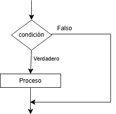
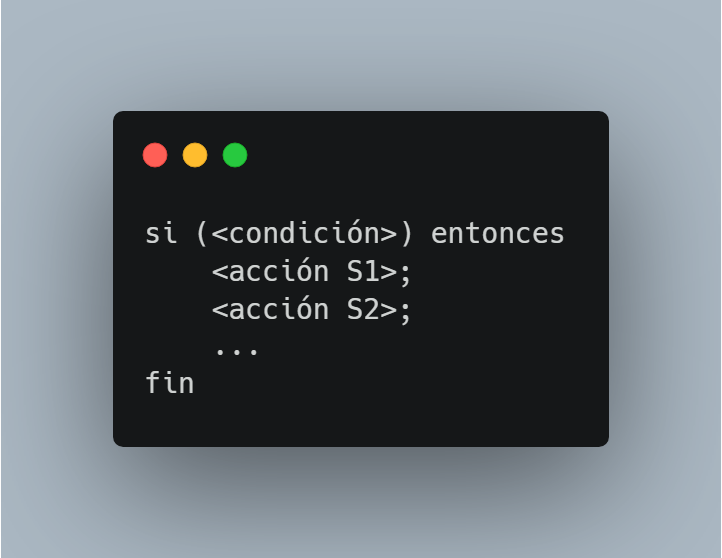
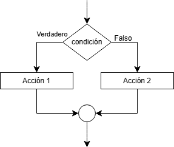
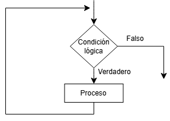
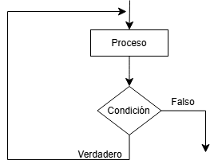
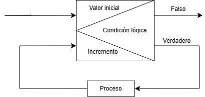

 

<h1 align="center">1.🔀 Estructuras Condicionales</h1>

 

Las **estructuras condicionales** nos permite tomar decisiones dentro de un programa, en otras palabras nos sirve para seleccionar la ruta que debe tomar el programa con base en una condición (si esta es verdadera se ejecuta ciertos bloques de código y si no ignora esos bloques). 
## 1.1 Estructuras condicionales simples (if)
Las **estructuras condicionales simples** igual que todas las otras estructuras evalúan una condición lógica si esta estructura es verdadera se ejecuta una serie de bloques de código, pero si la condición es falsa, el programa ignora los bloques dentro de la condición y continua con las siguientes instrucciones (fuera de la estructura condicional).
### 1.1.1 Características
> + La condición solo puede tener el valor de True y False.  
> + Solo tiene un camino opcional si no se cumple la condición no hace nada alternativo.  
> + La palabra que representa es **”Si”**, pero como instrucción se usa el **”If”**.  
> + Tiene flujo lineal, es decir, si la condición es falsa el programa continúa.  
### 1.1.2 📊 Diagrama de flujo 

 

### 1.1.3 📝 Pseudocódigo
El condicional simple en pseudocódigo se lo representa como "Si... entonces".

 

## 1.2 Estructuras condicionales dobles (if...else)
La **estructura condicional doble** al igual que la simple evalúa una condición lógica, pero a diferencia de la anterior esta estructura ofrece dos caminos diferentes según el valor que tenga la condición, es decir, si la condición es verdadera ejecuta ciertos bloques de códigos, pero si toma el valor de falsa ejecuta otros bloques de código. 

### 1.2.1 Características 
> + Ofrece dos caminos alternativos evaluando una condición  
> + El programa solo puede tomar uno de los dos caminos.  

### 1.2.2 📊 Diagrama de flujo

 

### 1.2.3 📝 Pseudocódigo
El condicional doble en pseudocódico se lo representa como "Si... entonces...sino".

 

## 1.3 Estructuras condicionales múltiples (switch)
La **estructura condicional múltiple** evalúa una condición y mos permite escoger entre dos y más opciones, esta estructura es diferente a las dos anteriores, debido a que, al evaluar la condición esta no tiene que tener un valor de booleano (true/ false) sino que una variable toma valores enteros, reales o de carácter. 

### 1.3.1 Características 
> + Compara una variable o expresión según los valores que puede tener.
> + Tiene un bloque opcional que se activa si ninguna de las onpciones angeriores coincide.
> + La variable o expresión tiene qeu tomar el valor de entero, reales o caracter.  

### 1.3.2 📊 Diagrama de flujo

 

### 1.3.3 📝 Pseudocódigo
En pseudocódigo la estructura cpndicional multiple es  "segun hacer".

 

<h1 align="center">2.🔁 Estructuras Repetitivas</h1>

 

Las estructuras repetitivas nos permite repetir un número determinado de veces la ejecuci+on de ciertas imdtrucciones, hasta que una condici+on sea falsa. 
También se le llama **bucle**.

## 2.1 Ciclo Mientras (while) 
Esta estrucrura repetitiva permite ejecutar bloques de código de manera repetitiva hasta que la condición qeu evalua sea falsa, es decir, evalua na condición si esta es verdadera entra al ejecutar el código dentro del bucle pero si es fasa ignora la estrucrura repetitiva y sigue con el programa.

### 2.1.1 Características 
> + Verifica la acondición hantes de ejecutar.
> + Si la condición es desde el inicio falsa, las instrucuiones dentro del bucle nunca se ejecuta.

### 2.1.2 📊 Diagrama de flujo

 

### 2.1.2 📝 Pseudocódigo
El ciclo mientras en pseudocódigo se lo representaca como "mientras":

## 2.2 Ciclo Hacer Mientras (Do...while)
En si se ejecuta de una forma similar al ciclo mientras, es decir, qeu evalua una condición y si esta es verdader ejecuta de nuevo el código y si es false sale del bucle, Pero a diferencia de la estructura antrior, esta primero ejecuta (una sola ves) y luego evalua la condición (para ejecutar de nu2vo), en otras palabras garantiza que el códgo haya sido ejecutado por lo menos una ves, 

### 2.2.1 Características
> + Evalua la condición al final del ciclo.
> + Garantiza qeu se ejecute una ves el código dentro del bicle.

### 2.2.2 📊 Diagrama de flujo

 

### 2.1.2 📝 Pseudocódigo
En pseudocódigo se representa en Ciclo Hacer Mientras como "Hacer...Mientras":

## Ciclo Para (for)
El Ciclo Para es usado cuando se conoce el número exacto de veces qye se va a ingresar al bucle. Además, este bucle a dierencia de los anteriores no solo se evalua la condición despues de la palabra "for" sino que se inicializa un contador, se define la condición y se define el incremento y el decremento.  
Las tres partes:
+ **Inicialización:** al contador de le da un valor.
+ **Condición:** Limita el numero de interaciones en el bucle.
+ **Incremento o Decremento:** Es cuanto se le resta al contador.
### 2.2.2 📊 Diagrama de flujo

 

### 2.1.2 📝 Pseudocódigo
En pseudocódigo se representa en Ciclo Para como "Para":

 
