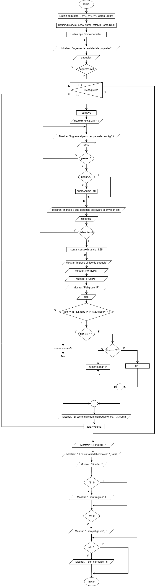

<div align="center"></div>

<br>

# 1. Planteamiento del problema
Las empresas de envíos procesan miles de paquetes al día. Calcular los precios a mano es lento y causa errores, ya que el costo varía según la distancia, el peso y el tipo de mercancía.
Este programa automatiza la facturación en ventanilla aplicando las siguientes reglas de negocio:
+ **Costo Base:** Se calcula multiplicando los km de distancia por $1.25.
+ **Restricción de Peso:** Si el paquete supera los 20 kg, se aplica un recargo extra de $10.00.
+ **Carga Frágil:** Si el producto es delicado, se suma un seguro obligatorio de $5.00.
+ **Carga Peligrosa:** Si es material peligroso, se añade un recargo fijo de $15.00
# 2. Análisis del problema
## 2.1. Entrada
Lo que el usuario necesita ingresar es la cantidad de paquetes, el peso de cada paquete, la distancia de entrega por cada paquete y el tipo de paquete.
## 2.2. Proceso
### 2.2.1. Validación de datos
Cada uno de los datos ingresados por el usuario para que el proceso se lleve sin problema para todo estos se necesita una **estructura condicional** para volver a pedir los datos hasta que sean los esperados: <br>
+ **Cantidad de paquetes:** Este dato no puede ser menor a 0 ni igual a 0.
+ **Peso y distancia:** En ambos casos toca controlar que no sean negativos ni igual a 0.
+ **Tipo:** Para esto tenemos que delimitar que el usuario solo ingrese las tres opciones disponibles que son Normal, Frágil y peligrosa.
### 2.2.2. Repetición para cada paquete
Para que el usuario pueda ingresar los datos requeridos por cada uno de los paquetes es necesario que se use un bucle repetitivo, en este caso "for" ya que sabemos cuantas veces se tiene que ingresar (la cantidad de paquetes ingresado por el usuario. <br>
De esta manera inicializaríamos un contador en uno, la condición sería que el contador tiene que ser menor o igual al número de paquetes e iríamos sumando 1 por cada repetición, cabe señalar que esto irá después de pedir al usuario la cantidad de paquetes. <br>
### 2.2.3. Cálculos
El cálculo principal es la multiplicación de la distancia por $1.25 para esto se necesita lo que es un acumulador para ir guardando el proceso.<br>
Luego usamos lo que es un condicional para establecer que si el peso supera los 20 kg se suma $10 al acumulador suma. <br>
Seguimos con el mismo lógica y utilizamos otro condicional para establecer si es que el paquete es frágil se suman $5 adicionales, pero si es peligroso ase suman $15. <br>
Imprimimos el resultado de la suma, pero como se tiene que obtener un resultado por cada paquete y la suma es un acumulador tenemos que inicializar la variable suma al inicio de cada ejecución del bucle de preguntas, pero al final de cada ejecución se almacena la suma en otra variable y se imprime esta. <br>
Además, usamos otro condicional para contar cuantos paquetes son de qué tipo, para esto usamos también 3 contadores más. <br>
## 2.3. Salida
Pala la salida tenemos lo siguiente: <br>
+ El precio de cada paquete.
+ El costo total. 
+ Cuantos paquetes de qué tipo hay.
# 3. Diseño de algoritmo 
<div align="center"></div>

<br>


# 4. Codificación 
**Lenguaje C**
```c
#include <stdio.h> 

int main () { 
    int paquetes, i, p=0, n=0, f=0; 
    float distancia, peso, suma, total=0; 
    char tipo; 

    do { 
        printf("Ingrese la cantidad de paquetes\n"); 
        scanf("%i", &paquetes); 
    } while(paquetes<=0);

    for(i=1; i<=paquetes; i++) {
        suma=0;
        printf("----------------------------------------\n");
        printf("Paquete %i:\n", i);

        do {
            printf("Ingrese el peso del paquete %i en kg \n", i);
            scanf("%f", &peso);
        } while (peso<=0);

        if (peso>20) {
            suma=suma+10;
        }

        do {
            printf("Ingrese a que distancia se llevara el envio en km \n");
            scanf("%f", &distancia);
        } while (distancia<=0);

        suma=suma+distancia*1.25;

        do {
            printf("Ingrese el tipo de paquete\n");
            printf("Normal=N\n");
            printf("Fragil=F\n");
            printf("Peligroso=P\n");
            scanf(" %c", &tipo);
        } while ((tipo!= 'N') && (tipo!='F') && (tipo!= 'P'));

        if (tipo == 'F') {
            suma=suma+5;
            f++;
        } else if (tipo == 'P') {
            suma=suma+15;
            p++;
        } else {
            n++;
        }

        printf("El costo individual del paquete %i es: %.2f\n", i, suma);
        total+=suma;
    }

    printf("--------------------------------------------------------------------\n");
    printf("REPORTE\n");
    printf("El costo total del envio es: %.2f\n", total);
    printf("Donde:\n");

    if (f!=0) {
        printf("%i son fragiles\n", f);
    }
    if (p!=0) {
        printf("%i son peligrosos\n", p);
    }
    if (n != 0) {
        printf("%i son normales\n", n);
    }
     
    return 0;
}
```

# 5. Validación de Datos
## 5.1. Prueba de escritorio

| Variables | paquetes | i | peso | distancia | Tipo | suma | total | f | p | n | SALIDA |
| :--- | :---: | :---: | :---: | :---: | :---: | :---: | :---: | :---: | :---: | :---: | :---: |
| Proceso | | | suma+=10 | suma+=distancia*1.25 | F : suma+=15 <br> P: suma+=15 <br> | total+=suma | | | | | |
|  | -5 | | | | | | | | | | |
|  | 4 | 1 | -34 | | | | | | | | |
|  | 4 | 1 | 25 | | | 10 | | | | | |
|  | 4 | 1 | 25 | 0 | | 10 | | | | | |
|  | 4 | 1 | 25 | 10 | | 10+12.5= 22.5 | | | | | |
|  | 4 | 1 | 25 | 10 | U | 22.5 | | | | | |
|  | 4 | 1 | 25 | 10 | F | 22.5+5= 27.5 | 27.5 | 1 | | | Costo individual: 27.5 |
